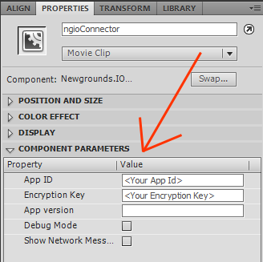
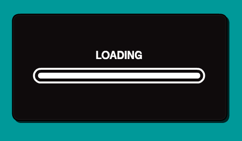
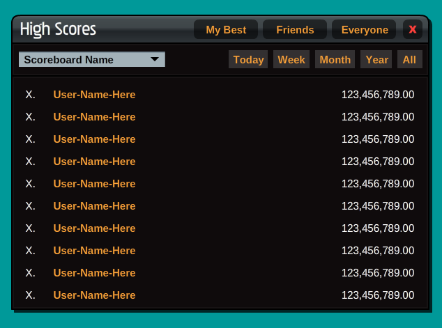
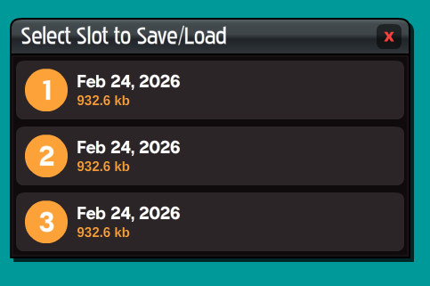

# NewgroundsIO-AS3

A comprehensive ActionScript 3.0 library for integrating Newgrounds.io API functionality into Flash games and applications. This library provides both simple wrapper methods for common tasks and low-level access to the full API for advanced use cases.

---

## Table of Contents

- [Installing the Library](#installing-the-library)
- [Using the Component Clips](#using-the-component-clips)
- [Using the NGIO Class](#using-the-ngio-class)
- [Advanced Use](#advanced-use)

---

## Installing the Library

### Option 1: Clone from Git (Recommended)

If you have Git installed, clone the repository:

```bash
git clone https://github.com/PsychoGoldfish/NewgroundsIO-AS3.git
```

Then follow one of the setup methods below to integrate with your project.

### Option 2: Download NGIO.zip

If you don't use Git, download the pre-built **NGIO.zip** file from the [v1.0.0 release](https://github.com/PsychoGoldfishNG/NewgroundsIO-AS3/releases/tag/v1.0.0). Extract it to a location on your computer.

### Method A: Same Folder as Your FLA (Simple)

This method is easiest for small projects:

1. From the NewgroundsIO-AS3 repo's **build** folder, copy these folders/files into your game's folder:
   - The entire **com** folder (contains cryptography utilities)
   - The entire **io** folder (contains the core library)
   - The **NGIO.as** file (the main wrapper class)

   Your folder structure should look like:
```
MyGame/
├── MyGame.fla
├── MyGame.as (your document class, if you have one)
├── NGIO.as
├── com/
│   └── hurlant/
├── io/
    └── newgrounds/
```

2. In Flash CS5, when you compile your SWF, ActionScript will automatically find these files in the same directory as your FLA.

3. You can now import and use NGIO:
```actionscript
import NGIO;
```

### Method B: Library Path (Recommended for Reusable Setup)

This method allows you to use the library across multiple projects without copying files:

#### Step 1: Choose a Library Location

Create a folder on your computer for ActionScript libraries. For example:
- Windows: `C:\ActionScript3\Libraries\`
- Mac: `~/ActionScript3\Libraries/`

From the NewgroundsIO-AS3 repo's **build** folder, copy these folders/files there:
- The entire **com** folder (contains cryptography utilities)
- The entire **io** folder (contains the core library)
- The **NGIO.as** file (the main wrapper class)

Your folder structure should look like:
```
C:\ActionScript3\Libraries\
├── NGIO.as
├── com/
│   └── hurlant/
└── io/
    └── newgrounds/
```

#### Step 2: Configure Flash CS5 Library Paths

1. In Flash CS5, open: **File** → **Publish Settings**
2. Click the **ActionScript 3.0 Settings** button (or go to **Edit** → **Preferences** → **ActionScript** → **ActionScript 3.0 Settings** in some versions)
3. Go to the **Source path** tab
4. Click the folder icon to add a new path
5. Browse to your library folder (e.g., `C:\ActionScript3\Libraries\`)
6. Click **OK** and **OK** again to save

#### Step 3: Verify Configuration

Create a new AS3 document and verify the import works:

```actionscript
import NGIO;
import io.newgrounds.SessionStatus;

// If this compiles without errors, your library path is configured correctly
trace("NewgroundsIO-AS3 library loaded successfully");
```
---

## Using the Component Clips

The library includes a **components_cs5.fla** file with pre-built Flash components for common Newgrounds.io features:

- **Connector Component** - Initializes your app, loads all metadata, and handles logging in users
- **Medal Popup Component** - Display unlocked medals to the user
- **ScoreBoard Components** - Show high scores
- **Cloud Save Components** - Interface for saving and loading cloud saves

### Copying Components to Your FLA

1. Open **components_cs5.fla** in Flash CS5 or later
2. On the timeline, find the component you want (Connector, Medal Popup, etc.)
3. Right-click the component symbol → **Copy**
4. Open your game's FLA file
5. Click on your stage where you want the component, then right-click → **Paste** (or use Ctrl+V)
6. Configure the component using the **Component Parameters** in the Properties panel



These components can be edited and customized to better fit your project.

### The Connector Component ###



This component preloads your game, along with all of your NGIO metadata.

Once preloading is complete, it will attempt to get the user logged in.

 * If the game is running directly on Newgrounds, this will be automatic.
 * If this game is running elsewhere, the user will be prompted to log in.

It should be placed in the first frame of your movie, or after any custom preloader you are using.

Set the following **Component Parameters**:

 * `App ID` - The App ID provided in your Newgrounds Project
 * `Encryption Key` - The AES-128 Encryption key provided in your Newgrounds Project
 * `App Version` - The current build version of your game (optional)
 * `Debug Mode` - Enable this to test medal unlocks and score posting without actually saving them on the server
 * `Show Network Messages` - Enable this to see all incoming and outgoing network packets. (Useful for advanced debugging)

#### Basic Use ####

Once the component has completed its tasks, it will automatically play the movie.

#### Advanced Use ####

Use an event listener for custom handling when the component has completed its tasks:

Give the component an instance name of `ngioConnector`.
```actionscript
import io.newgrounds.NgioEvent;

ngioConnector.addEventListener(NgioEvent.CONNECTOR_COMPLETED, function(e:NgioEvent) {
	// start your game!
});
```

#### Alternate Advanced Use ####

Edit the component clip, and locate the frame labelled `finished`.

Replace existing code, and add any new UI elements you may need.

### The Medal Popup Component ###


This component unlocks medals on the server, and displays the visual popup message.

It should be placed on a top level layer in your root timeline that covers any keyframes that a medal unlock could occur.

If you use multiple scenes, add this to each scene where medals can be unlocked.

You may also use the following **Component Parameter**:

 * **Show Even if Unlocked** - Check this if you want the popup to be displayed even if the user has already unlocked the requested medal.

#### Basic Use ####
This component automatically associates itself in the `NGIO` class, so you can trigger a medal unlock from anywhere in your game using the following code:

```actionscript
NGIO.medalPopup.unlock(int(medal_id.text));
```

### The Scoreboard Components ###



There are 3 variations of the Scoreboard component available for use:

 * **Scoreboard Full** - Use this is you have more than one scoreboard, and want to provide a cental place to view them all.
 * **Scoreboard Single** - Use this if you want to show a single scoreboard, and be able to view different date ranges and social groups.
 * **Scoreboard Minimalist** - Use this if you only want to show the scores for a single board with no other options.

All 3 versions use the same setup. Simply paste them wherever you want to show them to the user, and fill in the appropriate **Component Params**

 * `ScoreBoard ID` - If you have multiple boards, this will be the board that is shown when the component loads.  You can leave this set to 0 if you only have one board, or don't care wich is displayed by default.
 * `Period` - Select the time period you want to load by default.
 * `Show` - Select who to show scores for.  This can be 'Everyone', 'Friends', or 'My Best'.
 * `Tag` - If you are using tagged boards, set this to the tag you want to filter on.

#### Basic Use ####

Each scoreboard has a close (X) button in the top right.  You can edit the clip and remove it if you want to handle exiting the scoreboard screen yourself.

Otherwise, you can give the board you are using an instance name of `ngioScoreBoard` and listen for when the close button is clicked like so:

```actionscript
import io.newgrounds.NgioEvent;

ngioScoreBoard.addEventListener(NgioEvent.COMPONENT_CLOSED, function(e:NgioEvent) {
	// handle closing the board
});
```

Posting scores is done completely in code, like so:

```actionscript
import io.newgrounds.models.objects.ScoreBoard;
import io.newgrounds.models.objects.Score;

var scoreBoard:io.newgrounds.models.objects.ScoreBoard = NGIO.getScoreBoard(board_id);
var tag:String = null; // or whatever tag you want to post this score with

scoreBoard.postScore(score_value, tag, function(score:*, error:*):void {
    if (error == null && score != null) {
        trace("Score posted! Formatted value: " + score.formatted_value);
    } else {
        trace("Failed to post score: " + error);
    }
}, this);
```

### The Cloud Save Components ###



We have 2 cloud save components that both work exactly the same.

 * **Basic** - Used for basic setups where you have a total of 3 available save slots.
 * **Supporter** - Used for supporter-upgraded games that have a total of 10 available save slots.

These components can be used to load from or save to a cloud save slot.

Copy the component wherever you have a save or load dialogue and set the following **Component Parameters**:

 * **Action** - Either "Load Data" or "Save Data", depending on how you want it to behave.
 * **Sort By** - Set to Slot ID to keep slots in numeric order, or Last Updated for most recent saves to appear at the top.
 * **Show Slot Numbers** - Uncheck this if you want to hide the slot numbers (looks better when sorting by most recent)
 * **Use Raw Data** - Check this if you are using any custom serialization to work with raw string data, otherwise you can save and load native data types that will be automatically serialized.

#### Basic Use ####

Give the component an instance name of `saveSlotManager`.

For loading data, use the following code:

```actionscript
import io.newgrounds.NgioEvent;

saveSlotManager.addEventListener(NgioEvent.SAVESLOT_LOADED, function(e:NgioEvent) {
    if (e.error == null) {
        // you have your data now!
    	var loaded_data:* = e.data;
    }
});
```
For saving data, use the following code:

```actionscript
import io.newgrounds.NgioEvent;

saveSlotManager.addEventListener(NgioEvent.SAVESLOT_SAVED, function(e:NgioEvent) {
	if (e.error == null) {
        // your data saved successfully!
    }
});
```

Each saveslot manager has a close (X) button in the top right.  You can edit the clip and remove it if you want to handle exiting the save/load screen yourself. Otherwise, use the following code:

```actionscript
import io.newgrounds.NgioEvent;

saveSlotManager.addEventListener(NgioEvent.COMPONENT_CLOSED, function(e:NgioEvent) {
	// handle closing the save manager
});
```

---

## Using the NGIO Class

The `NGIO` class is the primary interface for most developers. It provides simple static methods that handle all the complexity of the API internally.

### Initialization

Before using any NGIO methods, you must initialize the library with your app credentials:

```actionscript
NGIO.init(
    "YOUR_APP_ID:YOUR_SESSION_ID",
    "YOUR_ENCRYPTION_KEY",
    "1.0.0",           // Your app version (optional)
    false              // Debug mode (optional, default false)
);
```

**Example:**
```actionscript
// In your main game class constructor or load handler
NGIO.init("12345:abcdef1234", "uXp/7Q9V4vG5L6R2W9zB8A==", "1.0.0");
```

### Understanding the Callback Model

Most NGIO methods that perform server operations use callbacks. When the operation completes, your callback function is called with the result.

**Callback Signature:**
```actionscript
private function onOperationComplete(error:* = null):void {
    if (error != null) {
        trace("Operation failed: " + error);
    } else {
        trace("Operation succeeded!");
    }
}
```

**Callbacks with Results:**
Some methods return specific data in the callback:

```actionscript
// Gets medals from the server
NGIO.loadMedals(function(medals:Array, error:*):void {
    if (error == null) {
        trace("Loaded " + medals.length + " medals");
    }
}, this);
```

**Scope Management:**
Use the optional `thisArg` parameter to control callback scope:

```actionscript
NGIO.checkSession(onSessionChecked, this);

private function onSessionChecked(status:SessionStatus):void {
    // 'this' refers to your object, not the NGIO callback scope
}
```

**Important: Asynchronous Execution**

Callbacks are **asynchronous**, meaning your code **continues to execute immediately** while the operation happens in the background. The callback function is only called later when the server responds.

```actionscript
trace("1. Starting medal load");

NGIO.loadMedals(function(medals:Array, error:*):void {
    trace("3. Medals loaded, count: " + medals.length);  // Called later!
}, this);

trace("2. Game continues running");  // This executes BEFORE the callback!
trace("4. This also runs before medals arrive");

// Output order:
// 1. Starting medal load
// 2. Game continues running
// 4. This also runs before medals arrive
// 3. Medals loaded, count: 5  (only appears after server responds)
```

**Common Mistake:**
```actionscript
// WRONG - medals will be null here!
NGIO.loadMedals(function(medals:Array, error:*):void {
    myMedals = medals;  // Set later
}, this);

// This runs BEFORE the callback, so myMedals is still null
if (myMedals != null) {  // Will be false!
    displayMedals(myMedals);  // Never runs
}

// CORRECT - put your code in the callback
NGIO.loadMedals(function(medals:Array, error:*):void {
    if (error == null) {
        displayMedals(medals);  // Now medals are available
    }
}, this);
```

### Data Loading Strategy

The NGIO library uses a **caching strategy** to store app data locally, reducing server requests and improving performance. Understanding when and how to load data is crucial for a good user experience.

#### Two-Phase Loading Approach

**Phase 1: Pre-Session (Immediate)**

Load app metadata immediately when your game starts, before the user logs in:

```actionscript
NGIO.loadAppData(
    ['currentVersion', 'hostApproved'],
    function(error:*):void {
        var version:String = NGIO.getCurrentVersion();
        var hostOk:Boolean = NGIO.getHostApproved();
        
        if (!hostOk) {
            trace("ERROR: App not approved to run on this domain!");
            // call NGIO.openOfficialUrl() in a click action to load a legal version
            return;
        }
        
        if (NGIO.getClientDeprecated()) {
            trace("New version available!");
            // call NGIO.openOfficialUrl() in a click action to load the new version
            return;
        }
        
        // Proceed with game startup
        proceedToMainMenu();
    },
    this
);
```

**Phase 2: Post-Session (After User Authenticates)**

Once you have an established user session, load interactive data like medals, scoreboards, and save slots:

```actionscript
NGIO.checkSession(function(status:io.newgrounds.SessionStatus):void {
    if (status.status == SessionStatus.LOGGED_IN) {
        // User is logged in, now load their personal data
        NGIO.loadAppData(
            ['medals', 'scoreBoards', 'saveSlots', 'medalScore'],
            function(error:*):void {
                if (error == null) {
                    trace("Loaded user data successfully");
                    showUserProfile();
                }
            },
            this
        );
    } else {
        trace("User is not authenticated, skipping data load");
    }
}, this);
```

#### Important Timing Warnings

**⚠️ Loading Medals Before Session:**
```actionscript
// WRONG - Called before user logs in
NGIO.loadMedals(function(medals:Array, error:*):void {
    // medals will have correct metadata BUT:
    // medal.unlocked will be FALSE for ALL medals (user not authenticated)
    // You won't know which medals the user has actually earned
}, this);
```

**✓ CORRECT:**
```actionscript
// Wait for authenticated session first
NGIO.checkSession(function(status:io.newgrounds.SessionStatus):void {
    if (status.status == SessionStatus.LOGGED_IN) {
        NGIO.loadMedals(function(medals:Array, error:*):void {
            // NOW medal.unlocked reflects actual user progress
            for each (var medal:* in medals) {
                trace(medal.name + " - Unlocked: " + medal.unlocked);
            }
        }, this);
    }
}, this);
```

**Similar Issue with Save Slots:**
- Loading before session: save slots will appear empty
- Loading after session: slots will contain the user's actual save data

#### Recommended Pattern

```actionscript
public function initializeGame():void {
    // Step 1: Check version and host (no session needed)
    NGIO.loadAppData(['currentVersion', 'hostApproved'], onCoreAppDataLoaded, this);
}

private function onCoreAppDataLoaded(error:*):void {
    if (!NGIO.getHostApproved()) {
        showError("App not authorized on this domain");
        return;
    }
    
    // Step 2: Establish session
    NGIO.checkSession(onSessionEstablished, this);
}

private function onSessionEstablished(status:io.newgrounds.SessionStatus):void {
    if (status.status == SessionStatus.LOGGED_IN) {
        // Step 3: Load user-specific data
        NGIO.loadAppData(['medals', 'scoreBoards', 'saveSlots', 'medalScore'], onUserAppDataLoaded, this);
    } else {
        // Step 3b: Handle non-logged-in session
        // Many statuses may be returned here (NOT_LOGGED_IN, EXPIRED, ERROR, etc.)
        // See "Check session status with server" section for proper handling of each case
    }
}

private function onUserAppDataLoaded(error:*):void {
    if (error == null) {
        showMainMenu();
    }
}
```

### Wrapper Functions

**Note on Caching:** Most wrapper methods come in two forms:
- `loadXYZ()` - Fetches from server (asynchronous, updates cache)
- `getXYZ()` - Returns cached data (synchronous, no network call)

Use `getXYZ()` methods when you already have data loaded - they're faster and don't require callbacks. When objects are updated on the server (through methods like `medal.unlock()` or `scoreBoard.postScore()`), the cached versions are automatically updated, so your references always reflect the current state:

```actionscript
// After loading medals once, use this for repeated access:
var medals:Array = NGIO.getMedals();  // Instant, no callback needed
for each (var medal:* in medals) {
    displayMedal(medal);
}

// Later, when a medal is unlocked:
var medal:* = NGIO.getMedal(123);
medal.unlock(function(error:*):void {
    if (error == null) {
        // The medal object from the cache is automatically updated
        trace(medal.unlocked);  // Now true!
        var allMedals:Array = NGIO.getMedals();
        for each (var m:* in allMedals) {
            if (m.id == 123) {
                trace("Cached medal is updated: " + m.unlocked);  // Also true!
            }
        }
    }
}, this);
```

#### Session Management

**Check if user has an active session:**
```actionscript
if (NGIO.hasSession()) {
    trace("User has a valid session");
}
```

**Check if user is logged in:**
```actionscript
if (NGIO.hasUser()) {
    trace("User is authenticated");
    var user:* = NGIO.getUser();
    trace("Welcome, " + user.name);
}
```

**Check session status with server:**
```actionscript
import io.newgrounds.SessionStatus;

NGIO.checkSession(function(status:io.newgrounds.SessionStatus):void {
    if (status == null) {
        trace("Could not get session status from server");
        return;
    }
    
    trace("Session Status: " + status.status);
    
    switch(status.status) {
        case SessionStatus.LOGGED_IN:
            trace("User logged in!");
            trace("  User ID: " + status.user.id);
            trace("  Username: " + status.user.name);
            trace("  Supporter: " + status.user.supporter);
            break;
            
        case SessionStatus.NOT_LOGGED_IN:
            trace("No user logged in (guest session)");
            trace("Call NGIO.openPassport() to let user log in");
            break;
            
        case SessionStatus.EXPIRED:
            trace("Session expired - user needs to re-authenticate");
            break;
            
        case SessionStatus.WAITING_FOR_PASSPORT:
            trace("Login window is open, waiting for user...");
            break;
            
        case SessionStatus.ERROR:
            trace("Session error: " + status.error.message);
            trace("Error code: " + status.error.code);
            break;
            
        default:
            trace("Session status: " + status.status);
    }
}, this);
```

**Monitoring Session Changes:**

You can check the session status repeatedly to monitor for changes. This is useful to pick up when a user logs in through the passport window or when a session expires:

```actionscript
import flash.utils.Timer;
import io.newgrounds.SessionStatus;

private var sessionCheckTimer:Timer;

public function startMonitoringSession():void {
    // Check session status every 5 seconds
    sessionCheckTimer = new Timer(5000);
    sessionCheckTimer.addEventListener(TimerEvent.TIMER, function(e:TimerEvent):void {
        NGIO.checkSession(onSessionStatusChanged, this);
    });
    sessionCheckTimer.start();
}

private function onSessionStatusChanged(status:io.newgrounds.SessionStatus):void {
    switch(status.status) {
        case SessionStatus.LOGGED_IN:
            trace("User just logged in!");
            refreshGameUI();
            sessionCheckTimer.stop();  // Stop polling once logged in
            break;
            
        case SessionStatus.EXPIRED:
            trace("User session expired");
            showReloginPrompt();
            break;
    }
}
```

**Open login window:**

Call this from a button click to let the user authenticate. Must be called from a user interaction (click event) for browser security:

```actionscript
// In your button's click handler
loginButton.addEventListener(MouseEvent.CLICK, function(e:MouseEvent):void {
    // Open passport login window
    NGIO.openPassport("_blank");
    
    // Start monitoring for login completion
    startPollingForLogin();
});

private function startPollingForLogin():void {
    var pollTimer:Timer = new Timer(2000, 0);  // Check every 2 seconds
    pollTimer.addEventListener(TimerEvent.TIMER, function(e:TimerEvent):void {
        NGIO.checkSession(function(status:io.newgrounds.SessionStatus):void {
            if (status.status == SessionStatus.LOGGED_IN) {
                trace("Login successful!");
                pollTimer.stop();
                refreshGameUI();
            } else if (status.status == SessionStatus.LOGIN_CANCELLED) {
                trace("User cancelled login");
                pollTimer.stop();
            }
        }, this);
    });
    pollTimer.start();
}
```

**End user session:**
```actionscript
NGIO.endSession(function():void {
    trace("User logged out");
}, this);
```

#### Medals

**Get all cached medals (recommended when data already loaded):**
```actionscript
import io.newgrounds.models.objects.Medal;

// Quick, synchronous - no callback needed
// Use this after you've already loaded medals with loadAppData()
var medals:Array = NGIO.getMedals();
if (medals != null) {
    for each (var medal:io.newgrounds.models.objects.Medal in medals) {
        trace("Medal: " + medal.name + " (Unlocked: " + medal.unlocked + ")");
    }
}
```

**Load medals from server:**
```actionscript
import io.newgrounds.models.objects.Medal;

// Use this only if you need to refresh data or haven't loaded yet
NGIO.loadMedals(function(medals:Array, error:*):void {
    if (error == null && medals != null) {
        for each (var medal:io.newgrounds.models.objects.Medal in medals) {
            trace("Medal: " + medal.name + " (Value: " + medal.value + ")");
            trace("  Unlocked: " + medal.unlocked);
            trace("  Secret: " + medal.secret);
        }
    } else {
        trace("Failed to load medals: " + error);
    }
}, this);
```

**Get a specific medal by ID (returns cached copy):**
```actionscript
import io.newgrounds.models.objects.Medal;

var medal:io.newgrounds.models.objects.Medal = NGIO.getMedal(123) as io.newgrounds.models.objects.Medal;
if (medal != null) {
    trace("Found medal: " + medal.name);
    
    // Medal objects have extended methods
    medal.unlock(function(error:*):void {
        if (error == null) {
            trace("Medal unlocked!");
        } else {
            trace("Failed to unlock medal: " + error);
        }
    }, this);
}
```

**Get user's total medal score (cached):**
```actionscript
// Quick synchronous access - no callback needed
var score:Number = NGIO.getMedalScore();
trace("Total medal score: " + score);
```

**Load medal score from server:**
```actionscript
// Use only if you need to refresh or haven't loaded yet
NGIO.loadMedalScore(function(score:Number, error:*):void {
    if (error == null) {
        trace("Updated medal score: " + score);
    }
}, this);
```

#### Scoreboards

**Get all cached scoreboards (recommended when data already loaded):**
```actionscript
import io.newgrounds.models.objects.ScoreBoard;

// Quick, synchronous - no callback needed
var boards:Array = NGIO.getScoreBoards();
if (boards != null) {
    for each (var board:io.newgrounds.models.objects.ScoreBoard in boards) {
        trace("Scoreboard: " + board.name);
    }
}
```

**Load scoreboards from server:**
```actionscript
import io.newgrounds.models.objects.ScoreBoard;

// Use this only if you need to refresh data or haven't loaded yet
NGIO.loadScoreBoards(function(boards:Array, error:*):void {
    if (error == null && boards != null) {
        for each (var board:io.newgrounds.models.objects.ScoreBoard in boards) {
            trace("Scoreboard: " + board.name);
            trace("  ID: " + board.id);
        }
    } else {
        trace("Failed to load scoreboards: " + error);
    }
}, this);
```

**Get a specific scoreboard by ID (returns cached copy):**
```actionscript
import io.newgrounds.models.objects.ScoreBoard;

var board:io.newgrounds.models.objects.ScoreBoard = NGIO.getScoreBoard(456) as io.newgrounds.models.objects.ScoreBoard;
if (board != null) {
    trace("Found scoreboard: " + board.name);
    
    // ScoreBoard objects have extended methods
    board.getScores(function(scores:Array, error:*):void {
        if (error == null) {
            trace("Top scores retrieved: " + scores.length);
        }
    }, this);
    
    board.postScore(9001, "Player123", function(error:*):void {
        if (error == null) {
            trace("Score submitted successfully!");
        } else {
            trace("Failed to post score: " + error);
        }
    }, this);
}
```

#### Cloud Saves

**Get all cached save slots (recommended when data already loaded):**
```actionscript
import io.newgrounds.models.objects.SaveSlot;

// Quick, synchronous - no callback needed
var slots:Array = NGIO.getSaveSlots();
if (slots != null) {
    trace("User has " + slots.length + " save slots");
    for each (var slot:io.newgrounds.models.objects.SaveSlot in slots) {
        trace("  Slot " + slot.id + ": " + Math.round(slot.size) + " bytes");
    }
}
```

**Load save slots from server:**
```actionscript
import io.newgrounds.models.objects.SaveSlot;

// Use this only if you need to refresh data or haven't loaded yet
NGIO.loadSaveSlots(function(slots:Array, error:*):void {
    if (error == null && slots != null) {
        trace("User has " + slots.length + " save slots");
        for each (var slot:io.newgrounds.models.objects.SaveSlot in slots) {
            trace("  Slot " + slot.id + ": " + Math.round(slot.size) + " bytes");
        }
    } else {
        trace("Failed to load save slots: " + error);
    }
}, this);
```

**Get a specific save slot (returns cached copy):**
```actionscript
import io.newgrounds.models.objects.SaveSlot;

var slot:io.newgrounds.models.objects.SaveSlot = NGIO.getSaveSlot(1) as io.newgrounds.models.objects.SaveSlot;
if (slot != null) {
    // SaveSlot objects have extended methods
    slot.loadData(function(data:*, error:*):void {
        if (error == null) {
            trace("Loaded save data: " + data);
            resumeGame(data);
        } else {
            trace("Failed to load save: " + error);
        }
    }, this);
    
    // To save data
    var saveData:Object = {level: 5, health: 100, inventory: ["key", "potion"]};
    slot.saveData(saveData, function(error:*):void {
        if (error == null) {
            trace("Save complete!");
        } else {
            trace("Failed to save: " + error);
        }
    }, this);
}
```

#### Version & Host Info

**Check if app is deprecated:**
```actionscript
if (NGIO.getClientDeprecated()) {
    trace("A new version is available!");
    // call NGIO.openOfficialUrl() in a click action to load the new version
}
```

**Check if current domain is approved:**
```actionscript
if (!NGIO.getHostApproved()) {
    trace("This domain is not authorized to run this app");
    // call NGIO.openOfficialUrl() in a click action to load a legal version
}
```

#### Server Utilities

**Get gateway version:**
```actionscript
NGIO.loadGatewayVersion(function(version:String, error:*):void {
    trace("Gateway: " + version);
}, this);
```

**Get current server time:**
```actionscript
NGIO.loadGatewayDate(function(date:Date, error:*):void {
    trace("Server time: " + date.toString());
}, this);
```

**Test server connectivity:**
```actionscript
NGIO.sendPing(function(pong:String, error:*):void {
    if (pong == "pong") {
        trace("Server is reachable!");
    }
}, this);
```

**Log custom events:**
```actionscript
NGIO.logEvent("level_completed", function(error:*):void {
    trace("Event logged");
}, this);
```

#### Navigation

**Open URLs:**
```actionscript
// Must be called from a user interaction

NGIO.openOfficialUrl("_blank", true); // load your latest, legal version
NGIO.openAuthorUrl("_blank", true);   // load your personal web page
NGIO.openMoreGames("_blank", true);   // loads the games page on Newgrounds
NGIO.openNewgrounds("_blank", true);  // loads the Newgrounds home page
```

**Open custom referral URL:**
```actionscript
NGIO.openReferral("my_referral_name", "_blank", true);
```

---

## Advanced Use

For advanced users who need direct access to the API, you can interact with the low-level `Core` class through `NGIO.core`.

### Direct Core Access

```actionscript
// Get direct access to the Core instance
var core:Core = NGIO.core;

// Access app state
trace("Current medals: " + core.appState.medals);

// Check if data has been loaded
if (core.appState.hasLoaded('medals')) {
    // Use the cached data
}
```

### Executing Custom Components

You can execute any component directly by creating it and passing it to the core:

```actionscript
// Create a custom component
var component:* = ObjectFactory.CreateComponent(
    "User",              // Component module
    "getUser",           // Component name
    null,                // Parameters
    NGIO.core            // Core reference
);

// Execute it
NGIO.core.executeComponent(component, function(response:*):void {
    if (response.error()) {
        trace("Error: " + response.getError().message);
    } else {
        var result:* = response.getResult();
        trace("User: " + result.user.name);
    }
}, this);
```

### Understanding Response Objects

Every component execution returns a `Response` object that contains either a result or an error:

```actionscript
private function onResponse(response:*):void {
    if (response.error()) {
        // Something went wrong
        var error:* = response.getError();
        trace("Error code: " + error.code);
        trace("Error message: " + error.message);
    } else {
        // Operation succeeded
        var result:* = response.getResult();
        
        // Result might be a single object or a list
        if (result.resultList != null) {
            // Process multiple results
            for each (var item:* in result.resultList) {
                trace(item);
            }
        } else {
            // Single result object
            trace(result);
        }
    }
}
```

### Queueing Multiple Components

You can queue multiple components to be executed together in a single request:

```actionscript
// Queue first component
var component1:* = ObjectFactory.CreateComponent("Medal", "unlock", {id: 123}, NGIO.core);
NGIO.core.queueComponent(component1);

// Queue second component
var component2:* = ObjectFactory.CreateComponent("Gateway", "ping", null, NGIO.core);
NGIO.core.queueComponent(component2);

// Execute both together
NGIO.core.executeQueue(function(responses:Array):void {
    for each (var response:* in responses) {
        if (!response.error()) {
            trace("Component executed successfully");
        }
    }
}), this);
```

---

## Resources

- Newgrounds.io API Documentation: https://www.newgrounds.io/
- ActionScript 3.0 Documentation: https://help.adobe.com/en_US/FlashPlatform/reference/actionscript/3/

---

## License

See LICENSE file for details.